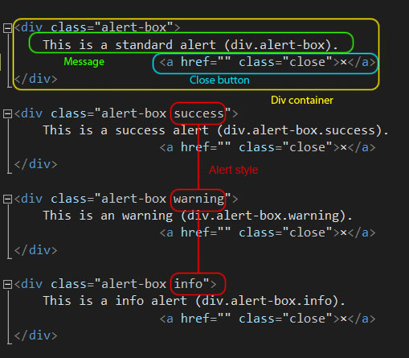
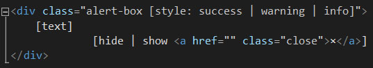
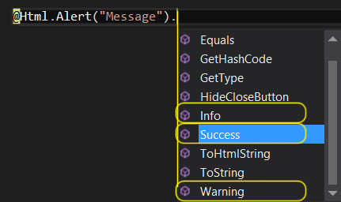
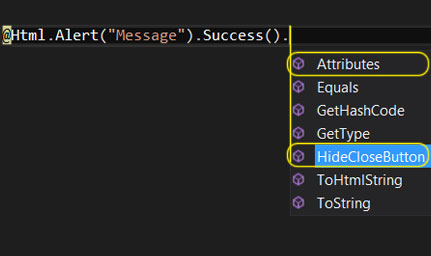

#WRITING CUSTOM HTML HELPERS FOR ASP.NET MVC 
*Ed Charbeneau*

##TRANSITIONING FROM WEB FORMS

As a web forms developer, I found the transition to MVC to be a bit of a shock at first. Without fully understanding the nature of MVC, I found the lack of a Toolbox filled with server controls to be confusing. However, once it became clear that the goal of MVC was to expose HTML markup and give developers full control over what is rendered to the browser, I quickly embraced the idea.

In MVC development, HTML helpers replace the server control, but the similarities aren’t exactly parallel. Whereas web forms and server controls were intended to bring the workflow of desktop forms to the web, MVC's HTML helpers simply provide a shortcut to writing out raw HTML elements that are frequently used.

The HTML helper, in most cases, is a method that returns a string. When we call a helper in a View using the razor syntax **@Html**, we are accessing the Html property of the View, which is an instance of the HtmlHelper class.

Writing extensions for the **HtmlHelper** class will allow us to create our own custom helpers to encapsulate complex HTML markup. Custom helpers also promote the use of reusable code and are unit testable. Custom helpers can be configured by passing values to the constructor, via fluent configuration, strongly typing, or a combination of both, and ultimately return a string. 

##HOW TO BEGIN

The first step in writing an HTML helper is finding code within our project that you intend on reusing. For the extent of this article I will be using an **Alert** message as an example. The alert is a UI element that displays a message which has a default, success, warning, or information style. The alert element’s markup is simple in construction but gives us an adequate sample for the scope of this article.

With our code targeted, we’ll examine the alert markup and see how we can break it down and construct reusable pieces of content. The alert is made up of a div container, a message, a close button and can have multiple styles applied to it. If we examine the markup, we can see that there are parts of the element that are static, and parts that can be broken down into options that can be set as parameters. 

*In addition to the HTML, the alert will require CSS and JavaScript in order to function. The CSS and JavaScript are beyond the scope of this article but are included in the final example at the end of this article.*
 
##WRITING A SPECIFICATION

Personally, once I have my HTML defined, I prefer to start writing a specification before I do anything else. Writing a specification isn’t a necessary step for creating a custom HTML helper, but it gives me a guide to how the HTML helper will function and what the desired syntax will be. A spec will also promote the use of semantic code, which improves discoverability for others that may be using the helper.

Using a text file, I spec out how the helper will function and, since I will be unit testing the code, I’ll save the spec to my test project. There are several parameters that will be required to configure the Alert element: the text to be displayed, the style of the alert, and a close button that can be toggled. I’ll also be giving the Alert a default configuration that will only require that the text parameter be set. In addition to the elements parameters, we’ll allow HTML attributes to be passed to the helper as well (which I'll return to once we have our basic implementation up and running). Each configuration of the **Alert** helper is written out in the spec so it can be followed during implementation.

AlertHelperSpec.html

    //Given the Alert HTML Helper method
    
    //Then Render the HTML
    
    //Default Alert
    @Html.Alert(text:"message") [.HideCloseButton()]
    
    

    	Message
    	<a href="" class="close">×</a>
    

    
    //Success Alert
    
    @Html.Alert(text:"message", style:AlertStyle.Success [,hideCloseButton:false ,htmlAttributes:object])
    
    

    	Message
    	<a href="" class="close">×</a>
    

    
    //Warning Alert
    
    @Html.Alert(text:"message", style:AlertStyle.Warning [,hideCloseButton:false ,htmlAttributes:object])
    
    

    	Message
    	<a href="" class="close">×</a>
    

    
    //Info Alert
    
    @Html.Alert(text:"message", style:AlertStyle.Info [,hideCloseButton:false ,htmlAttributes:object])
    
    

    	Message
    	<a href="" class="close">×</a>
    

##UNIT TESTING

ASP.NET MVC is highly regarded for its ability to be unit tested, and custom HTML helpers can be thoroughly tested too. With the right setup, unit testing your custom helper isn’t difficult: 

First, we need to create an instance of the **HtmlHelper** class so our extension method can be tested. Next, the custom method is called, and finally we can check the results against our expectations.

So, before we can write our test, we will need to create an instance of the **HtmlHelper** class. However, the **HtmlHelper** class has no default constructor, so a little work must be done up front to get an instance. To create an instance of **HtmlHelper**, we must specify a context and view data container - for the scope of this article, fakes will do just fine. Since each test will require an instance of **HtmlHelper**, I’ve created an **HtmlHelperFactory** class to create the instances.

###HtmlHelperFactory

Now that the **HtmlHelperFactory** is available, getting an instance of HtmlHelper is as simple as calling **HtmlHelperFactory.Create()**.

Using the first spec, I’ll create a unit test for the default alert. In this test, the **Alert** method will be called, and should return the HTML markup we defined, the message specified, with no additional style, and a visible close button. 

First, we arrange our expected output and create an instance of HtmlHelper:

    //Spec
    //Should render an default alert box
    //@Html.Alert(text:"message")
    //arrange
    string htmlAlert = @"
message<a class=""close"" href="""">×</a>
";
    var html = HtmlHelperFactory.Create();

At this point, the method has not been defined yet, so we’ll use what has been defined in the spec to guide us:

    //act
    var result = html.Alert("message").ToHtmlString();

Finally, we check our results with the expected output using **Assert.AreEqual**:

    //assert
    Assert.AreEqual(htmlAlert, result, ignoreCase: true);

So now the first unit test is written, but before it can be put to use the **Alert** method must be created. This test-first approach ensures that the custom Helper we write gives us the result we defined as HTML in our spec and, as each spec is fulfilled, this process will be repeated until all the specs are completed and satisfied.

##BASIC IMPLEMENTATION

Before creating our implementation, there are a few things we should know about MVC and the **HtmlHelper** class. The **HtmlHelper** class provides methods that help you create HTML controls programmatically; all **HtmlHelper** methods generate HTML and return the result as a string.

We’ll begin by creating a new class and implementing the **IHtmlString** interface - this provides the **ToHtmlString** method, which is used by MVC to render the control to the View. Next we override the **ToString** method of our class; the **ToString** and **ToHtmlString** methods will return the same result, which is a common practice for **HtmlHelpers**.

    public class AlertBox : IHtmlString
    {
        private readonly string text;

        public AlertBox(string text)
        {
            this.html = html;
            this.text = text;
        }

        //Render HTML
        public override string ToString()
        {
            return "";
        }

        //Return ToString
        public string ToHtmlString()
        {
            return ToString();
        }
    }

Now that we have an **HtmlHelper** class, we need to be able to call it from MVC. We’ll do this by writing an extension method that returns our custom **HtmlHelper** class:

    /// 

    /// Generates an Alert message
    /// 

    public static class AlertHtmlHelper
    {
        public static AlertBox Alert(this HtmlHelper html, string text)
        {
            return new AlertBox(text);
        }
    }

At this point a complete scaffold of our code is complete, and our unit test should execute but fail to pass.

To finish our basic implementation and pass the unit test, we’ll need to set up our parameters and render the HTML. MVC provides the **TagBuilder** class for building HTML, which we’ll use to build our render method.

        private string RenderAlert()
        {

            var wrapper = new TagBuilder("div");
            wrapper.AddCssClass("alert-box");

            var closeButton = new TagBuilder("a");
            closeButton.AddCssClass("close");
            closeButton.Attributes.Add("href", "");
            closeButton.InnerHtml = "×";

            wrapper.InnerHtml = text;
            wrapper.InnerHtml += closeButton.ToString();

            return wrapper.ToString();
        }

        //Render HTML
        public override string ToString()
        {
           return RenderAlert();
        }

The HTML helper should now pass the unit test.

With the basic implementation complete, we can easily expand on the HTML helper by adding additional options. Following our spec, we’ll add the option to change the style of the alert. Once again, we start with a unit test and then modify our code to complete the test:

    [TestMethod]
    public void ShouldCreateSuccessAlert()
    {
	    //Spec 
	    //Should render a Success alert box
	    //@Html.Alert(text:"message", style:AlertStyle.Success)
	    //arrange
	    string htmlAlert = @"
message<a class=""close"" href="""">×</a>
";
	    var html = HtmlHelperFactory.Create();
	
	    //act
	    var result = html.Alert("message", AlertStyle.Success).ToHtmlString();
	
	    //assert
	    Assert.AreEqual(htmlAlert, result, ignoreCase: true);
    }

    public class AlertBox : IHtmlString
    {

    private readonly string text;

    private readonly AlertStyle alertStyle;
 
    private readonly bool hideCloseButton;

    public AlertBox(HtmlHelper html, string text, AlertStyle style, bool hideCloseButton)
         {
            this.html = html;
            this.text = text;
            this.alertStyle = style;
            this.hideCloseButton = hideCloseButton;
         }
 
		private string RenderAlert()
        {
            if (alertStyle != AlertStyle.Default)
                wrapper.AddCssClass(alertStyle.ToString().ToLower());
            wrapper.AddCssClass("alert-box");
 
            //build html
            wrapper.InnerHtml = text;
            
            //Add close button
            if (!hideCloseButton)
                wrapper.InnerHtml += RenderCloseButton();
            
            return wrapper.ToString();
        }

        private static TagBuilder RenderCloseButton()
        {
             //<a href="" class="close">x</a>
             var closeButton = new TagBuilder("a");
             closeButton.AddCssClass("close");
             closeButton.Attributes.Add("href", "");
             closeButton.InnerHtml = "×";
             return closeButton;
        }
    }

Finally, we’ll make our helper more flexible by giving the end user the ability to define additional HTML attributes. The **TagBuilder**’s **MergeAttributes** method adds a specified attribute to the tag being rendered. In addition to the **MergeAttributes** method, the **HtmlHelper** **AnonymousObjectToHtmlAttributes** is used to allow an anonymous object to be used to define additional parameters:

    public class AlertBox : IHtmlString
    {...
    	private object htmlAttributes;
	
	    public AlertBox(string text, AlertStyle style, bool hideCloseButton = false, object htmlAttributes = null)
	
	    private string RenderAlert()
	    { ...
	    	wrapper.MergeAttributes(htmlAttributes != null ? HtmlHelper.AnonymousObjectToHtmlAttributes(htmlAttributes) : null);
	    ...}
    }

The basic implementation is now complete and the custom helper can be referernced and called in any ASP.NET MVC project. Using the synax outlined in the spec an Alert can easily be placed anywhere in our project.

     @Html.Alert("Message")

##FLUENT CONFIGURATION

Next, we'll build upon the basic HTML helper we have created thus far. Our goal will be to add a fluent API configuration to our existing Alert helper. The fluent API won't add functionality to the helper, instead we will be simplifying the syntax used for setting options on our helper; some refer to this as adding syntactic sugar.

Taking a look at the basic implementation of the Alert helper we can see there are several options that can be set when calling the Alert helper.

     @Html.Alert(text, alertStyle [Default | Success | Warning | Info], hideCloseButton, htmlAttributes)

Instead of using the constructor as the only manner of setting options on our helper we will guide the user of our helper through the options. In addition to making options simpler to set, we will also be making our code easier to read. The end result should be a syntax which resembles the spoken intent of its use. 

    @Html.Alert(text).Success().HideCloseButton()
    “Alert success, hide the close button”

Designing a fluent API requires some planning; again I prefer to write a specification of how I intend the code to function. Using the specification from earlier I’ll plan out the code and show the expected results. 

    //Success Alert
    @Html.Alert(text:"message").Success() [.HideCloseButton().Attributes(object)] //Fluent
    
    

        Message
                          <a href="" class="close">×</a>
    

    
For the Alert helper we’ll be eliminating the need to specify the alert style as an enumerator and instead just call a method that defines the style by name. In this example we’ll use interfaces to chain our methods together so the user is guided through the options. In addition to guiding the user, we can control what options are available as well, for example when the style is set only the HideCloseButton and Attributes methods will be available.

To create the API we’ll need to define an interface for setting the style and a second interface for setting the remaining options. Our Alert helper will implement both interfaces.

The IAlertBox interface outlines three method signatures, Success, Warning, and Info. These methods will return the IAlertBoxFluentOptions interface. We will use these methods to set our alert style.

    public interface IAlertBox : IAlertBoxFluentOptions
    {
        IAlertBoxFluentOptions Success();
        IAlertBoxFluentOptions Warning();
        IAlertBoxFluentOptions Info();
    }

The IAlertBoxFluentOptions interface outlines the rest of the options for the Alert. The method signatures HideCloseButton and Attributes also return IAlertBoxFluentOptions, this will prevent the style option from being set again.

    public interface IAlertBoxFluentOptions : IHtmlString
    {
        IAlertBoxFluentOptions HideCloseButton(bool hideCloseButton = true);
        IAlertBoxFluentOptions Attributes(object htmlAttributes);
    }

Now that we have defined our interfaces, we will need to create a class which implements IAlertBoxFluentOptions. Because the class will be returned at the end of the method call, it will also be responsible for rendering HTML and should function as an HTML Helper which implements the IHtmlString interface.

    public class AlertBoxFluentOptions : IHtmlString, IAlertBoxFluentOptions
    {
        private readonly AlertBox parent;

        public AlertBoxFluentOptions(AlertBox parent)
        {
            this.parent = parent;
        }

        public IAlertBoxFluentOptions HideCloseButton(bool hideCloseButton = true)
        {
            return parent.HideCloseButton(hideCloseButton);
        }

        public IAlertBoxFluentOptions Attributes(object htmlAttributes)
        {
            return parent.Attributes(htmlAttributes);
        }

        public override string ToString()
        {
            return parent.ToString();
        }

        public string ToHtmlString()
        {
            return ToString();
        }
    }

The AlertBoxFluentHelpler class is essentially extending the functionality of the AlertBox class. The AlertBoxFluentHelper needs to be able to call back to the AlertBox we began building and set properties and call the render method, to accomplish these task we will pass an instance of AlerBox in the constructor of the AlertFluentHelper. Using the AlertBox referenced as “parent”, we can call the parent’s ToString and ToHtmlString methods and return the results.

To complete the fluent API we need to implement both IAlertBox and IAlertBoxFluentHelperOptions in the AlertBox class. Each method will be responsible for setting the desired value and returns a new AlertBoxFluentOptions object passing itself to the constructor.

		#region FluentAPI

        /// 

        /// Sets the display style to Success
        /// 

        public IAlertBoxFluentOptions Success()
        {
            alertStyle = AlertStyle.Success;
            return new AlertBoxFluentOptions(this);
        }

        /// 

        /// Sets the display style to Warning
        /// 

        /// <returns></returns>
        public IAlertBoxFluentOptions Warning()
        {
            alertStyle = AlertStyle.Warning;
            return new AlertBoxFluentOptions(this);
        }

        /// 

        /// Sets the display style to Info
        /// 

        /// <returns></returns>
        public IAlertBoxFluentOptions Info()
        {
            alertStyle = AlertStyle.Info;
            return new AlertBoxFluentOptions(this);
        }
        
        /// 

        /// Sets the close button visibility
        /// 

        /// <returns></returns>
        public IAlertBoxFluentOptions HideCloseButton(bool hideCloseButton = true)
        {
            this.hideCloseButton = hideCloseButton;
            return new AlertBoxFluentOptions(this);
        }

        /// 

        /// An object that contains the HTML attributes to set for the element.
        /// 

        /// <param name="htmlAttributes"></param>
        /// <returns></returns>
        public IAlertBoxFluentOptions Attributes(object htmlAttributes)
        {
            this.htmlAttributes = htmlAttributes;
            return new AlertBoxFluentOptions(this);
        }
        #endregion //FluentAPI

The fluent API is now complete and ready to be used.

The code required for creating a fluent API may seem unnecessary or overly complex for this example, however more complex HTML Helpers could greatly benefit from this type of API. Complexity, frequency of use and the type of end user your HTML Helper is being designed for are all considerations when for including a fluent API for your project.

##STRONGLY TYPED HELPERS

Finally we’ll complete our overview of custom HTML Helpers by learning about strongly typed HTML Helpers. If you are already familiar with MVC you have probably seen or used strongly typed HTML Helpers. These helpers use the ElementFor convention, meaning the helper has a For suffix indicating it is strongly typed.
To create a strongly typed helper we need to understand what makes them different from regular HTML Helpers. Strongly typed helpers are used to pass data from the Model to the Helper using expression syntax. HtmlHelper<TModel> class is a strongly typed subclass of the HtmlHelper class. 

In addition to HtmlHelper<TModel> we will be using Expression<Func<T,T>> to collect information about the Model. Expression<Func<T,T>>, part of LINQ, represents an expression tree of a delegate which accepts a parameter and returns a result. When writing HTML Helpers the expression will allow the Helper to accept lambda expressions as parameters. All of the hard work of extracting data from the Model via lambda expression has been done for us in MVC; the method ModelMetadata.FromLambdaExpression will return the Model data based on the expression.

Since we already have the basic Alert Html Helper built, we only need to create additional extension methods and allow them to call the Alert helper.

        public static AlertBox AlertFor<TModel, TTextProperty, TStyleProperty>(this HtmlHelper<TModel> html,
            Expression<Func<TModel, TTextProperty>> textExpression,
            Expression<Func<TModel, TStyleProperty>> styleExpression,
            bool hideCloseButton = false,
            object htmlAttributes = null
            )
        {
            var text = (string)ModelMetadata.FromLambdaExpression(textExpression, html.ViewData).Model;
            var alertStyle = (AlertStyle)ModelMetadata.FromLambdaExpression(styleExpression, html.ViewData).Model;

            return new AlertBox(text, alertStyle, hideCloseButton, htmlAttributes);
        }

Usage:

    @Html.AlertFor(m => m.AlertBoxText, m => m.AlertBoxStyle)

The strongly typed HTML Helpers provide better compile time suport and benefit from intellisense. Adding this option to your HTML Helper extends its usefulness and gives the end user more flexibility.

##FINAL RESULTS
Basic

Fluent

Strongly typed

##CONSIDERATIONS

When to create a helper

When to use basic, fluent, strongly typed or all.

What’s next, templates, and complex controls

Resources